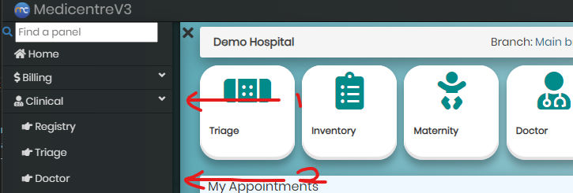
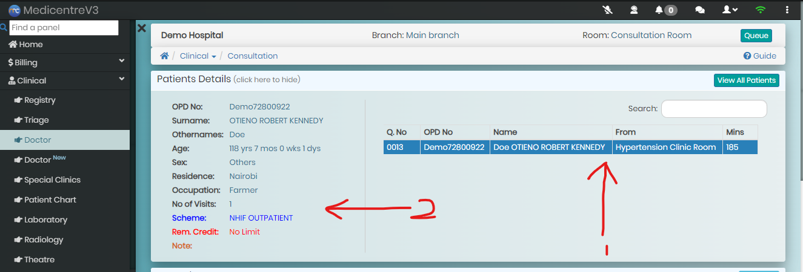
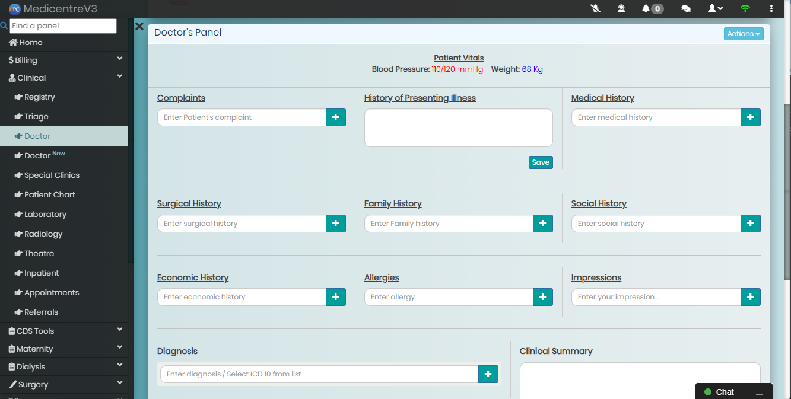
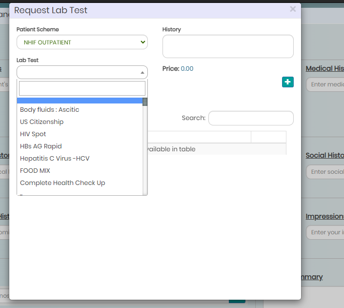
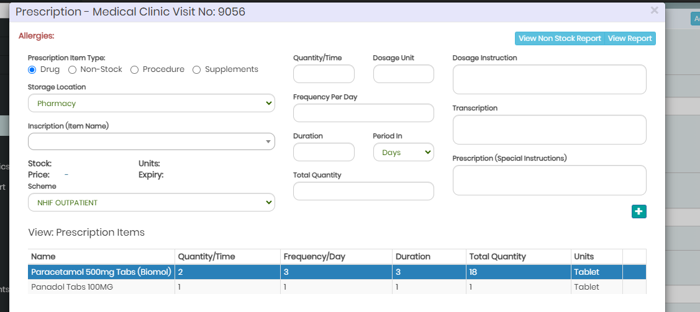

# Doctors Panel User Guide

This guide provides detailed instructions for using the Doctors Panel in the Clinical module of MedicentreV3.

## Table of Contents

1. [Overview](#overview)
2. [Accessing the Doctors Panel](#accessing-the-doctors-panel)
3. [Selecting a Patient](#selecting-a-patient)
4. [Capturing Clinical Notes](#capturing-clinical-notes)
   - [Complaints](#complaints)
   - [History of Present Illness (HPI)](#history-of-present-illness-hpi)
   - [Medical History](#medical-history)
   - [Allergies](#allergies)
   - [Impression](#impression)
   - [Diagnosis](#diagnosis)
5. [Creating Laboratory Requests](#creating-laboratory-requests)
6. [Prescriptions](#prescriptions)
   - [Creating a Prescription Item](#creating-a-prescription-item)
   - [Updating a Prescription Item](#updating-a-prescription-item)
   - [Deleting a Prescription Item](#deleting-a-prescription-item)
   - [Generating Prescription Report](#generating-prescription-report)

## Overview

The Doctors Panel is a key feature in the Clinical module of MedicentreV3, allowing clinicians to manage patient interactions, capture clinical notes, create laboratory requests, and manage prescriptions efficiently.

## Accessing the Doctors Panel

To access the Doctors Panel:

1. Log in to MedicentreV3.
2. Navigate to the **Clinical** module from the side navigation.
3. Click on the **Doctor** link to open the Doctors Panel.

## Selecting a Patient

To select a patient from the mini-queue:

1. Locate the mini-queue table at the top-right corner of the Doctors Panel.
2. Click on the patient’s name from the list to load their details in the main panel.

## Capturing Clinical Notes

The Doctors Panel allows you to capture various clinical notes for the selected patient. Each type of note is captured in a specific field.

### Complaints

To record the patient’s complaints:

1. Locate the **Complaints** field in the clinical notes section.
2. Enter the patient's primary complaints.
3. Click the **+** button to add.

### History of Present Illness (HPI)

To capture the History of Present Illness (HPI):

1. Enter detailed information about the HPI in the **HPI** field.
2. Click on the **Save** button to save.

### Medical History

To document the patient’s medical history:

1. Fill in the **Medical History** field with relevant past medical conditions.
2. Click the **+** button to add.
3. Do this for all the other **History** fields.

### Allergies

To note any allergies the patient has:

1. Enter known allergies in the **Allergies** field.
2. Click the **+** button to add.

### Impression

To record your clinical impression:

1. Use the **Impression** field to document your initial thoughts or working diagnosis.
2. Click the **+** button to add.

### Diagnosis

To capture the final diagnosis:

1. Enter the confirmed diagnosis in the **Diagnosis** field. Type to filter out **ICD 10/11** diagnosis for selection.
2. Click the **+** button to add.

## Creating Laboratory Requests

To create a laboratory request for the patient:

1. Click on the **Actions** menu of the panel to access the **Lab Request** section of the Doctors Panel.
2. Select a lab test to add to the request.
3. Capture the **History** if applicable.
4. Click **+** button to add the lab test to the laboratory request.

## Prescriptions

The Doctors Panel allows you to manage prescriptions for the selected patient. You can create, update, and delete prescription items, as well as generate a prescription report.

To access the **Prescription** window, Click on the **Actions** menu followed by the **Prescription** action item.

### Creating a Prescription Item

To create a new prescription item:

1. On to the **Prescriptions** window, select the item based on the provided categories.
2. Capture the prescription item details.
3. Click the **+** to add the item to the prescription.

### Updating a Prescription Item

To update an existing prescription item:

1. Select a prescription item from the loaded list.
2. Make modifications.
3. Click **Update** to save the changes.

### Deleting a Prescription Item

To delete a prescription item:

1. Find the item on the prescriptions list.
2. Right click on the item followed by clicking on the **Delete** option.
3. Confirm the deletion to remove the item from the prescription.

### Generating Prescription Report

To generate a prescription report:

1. After adding all prescription items, click on **View Report** button, on the top-right corner of the window.
2. Review the report for accuracy.
3. Print or save the report as needed.

---

This guide should assist clinicians in effectively using the Doctors Panel within MedicentreV3.
