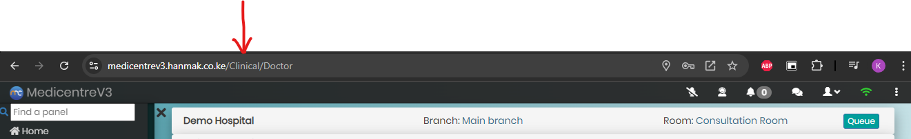

# User Guide Repository for MedicentreV3 and LoyonERP

Welcome to the User Guide repository for **MedicentreV3** and **LoyonERP**. This repository houses markdown-based user guides for various pages across both applications. We encourage team collaboration to ensure comprehensive and accurate documentation.

## Repository Structure

The user guides are organized into folders based on the application name and the page URL structure. The folder structure is as follows:

- **App Name:** Represents the name of the application (either `MedicentreV3` or `LoyonERP`).
- **Page URL:** Represents the structure of the panel's URL for which the user guide is being created. E.g. For **_Doctor_** panel's user guide, create or edit a file named **_Doctor.md_**, under the **_MedicentreV3 > Clinical_** folder. See image below.



## Contribution Guidelines

We appreciate the team contributions to improve the user guides. Please follow the steps below to contribute:

### 1. Fork the Repository

Fork this repository to your own GitHub account by clicking the "Fork" button at the top right of this page. This will create a copy of the repository under your GitHub account.

### 2. Clone Your Fork

Clone the forked repository to your local machine:

```bash
git clone https://github.com/your-username/user-guide-repo.git
cd user-guide-repo

git checkout -b feature/update-user-guide

git add .
git commit -m "Updated Doctor user guide on MedicentreV3"
git push origin feature/update-user-guide
```

### 3. Create a Pull Request

Go to the original repository and click on the "New Pull Request" button. Choose your fork and the branch you created, and submit the pull request for review.

### 4. Await Review

Once your pull request is submitted, it will be reviewed by the maintainers. Please be patient, as this process may take some time. If any changes are requested, kindly make the necessary updates.

### 5. Merge Your Fork

All contributions will be reviewed for accuracy, completeness, and adherence to the repository's structure. Once approved, your changes will be merged into the main branch.

**Note:**
It is advised to place screenshots, on a folder labelled *screenshots*, on the user guide's working directory.

Happy documenting!
